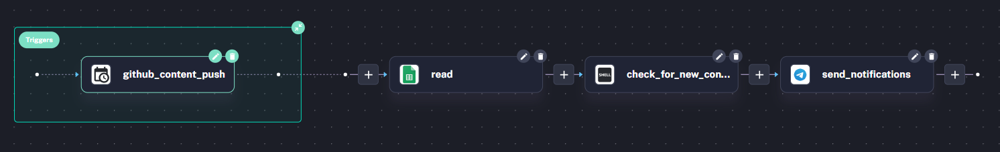
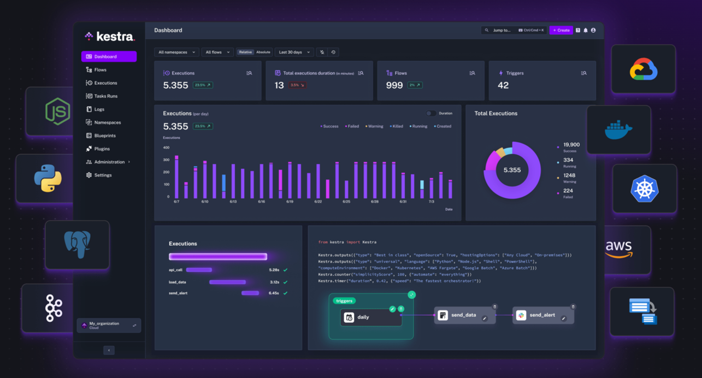

# EduKeastra

EduKeastra is a fully automated platform for managing study content and student subscriptions. This project integrates **GitHub** and **Kestra** to automate the process of notifying students about newly added assignments, tests, and study materials.

## Features
- **Subscription Management**: Students can subscribe to the platform by providing their Telegram ID and email.
- **Content Updates**: Add assignments, test papers, or study materials to the repository, and they are automatically processed.
- **Automated Notifications**: Subscribers receive an email notification whenever new content is added to the platform.
- **GitHub Integration**: All data, including subscribers and content, is stored and managed in the GitHub repository.
- **Kestra Workflow Automation**: Automates the task of processing content updates and notifying subscribers.

---

## Repository Structure

```plaintext

├──kestra.yml                    # Kestra workflow
├── subscribers.txt              # Stores the Telegram IDs of subscribed students
├── previous_hash.txt            # Stores the previous_hash
├── index.html                   # Frontend HTML for the subscription page and study material.
├── styles/
│   └── styles.css               # Stylesheet for the subscription page
├── README.md                    # Project documentation

```

## How It Works

### 1. Frontend for Subscription
Students can subscribe to the platform by providing their **Telegram ID** and **email** via the simple **HTML/CSS page**:
- **`index.html`**: Contains the form for subscription and content of the study.
- **`style.css`**: Provides styling for the page.

### 2. GitHub for Data Storage
- **`subscribers.txt`**: Stores the Telegram IDs of all subscribed students.
- **`previous_hash.txt`**: Contains the previous_hash values

### 3. Kestra Workflow

Automates the following tasks:
- Storing subscriber details.
- Processing new content additions.
- Sending email and telegram notifications to all subscribers.

### 4. GitHub Actions
Triggers the Kestra workflow whenever:
- A new subscriber is added to `subscribers.txt`.

---

## Prerequisites

- **Kestra** installed and running.

- **GitHub Repository** with:
  - `subscribers.txt` (for storing Telegram IDs).
- **GitHub Actions** enabled.
- **API Key** for Kestra (to trigger workflows).

---

## Setup Guide

### 1. Clone the Repository
```bash
git clone https://github.com/Hritikraj8804/EduKestra.git
cd EduKestra
```
## 2. Host the Frontend

Host the `index.html` and `style.css` files on any static website hosting service, such as **GitHub Pages** or **Netlify**.

---

## Usage

### Subscribe to StudentHub
1. Open the hosted **subscription page**.
2. Enter your **Telegram ID** and **email address**.
3. Click **"Subscribe."** You will receive a confirmation email upon successful subscription.

### Add New Content
1. Update the `index.html` file with new assignments, test papers, or study materials.
2. Commit and push changes to the repository:
   ```bash
   git add index.html
   git commit -m "Added new content"
   git push origin main
    ```

## Contact

For any queries, feel free to reach out:
- **Linkedin**: [Hritik Raj](https://www.linkedin.com/in/hritik-raj-8804hr/)
- **Email**: hritikraj8804@gmail.com
- **Telegram**: [@hritik_rajj](https://t.me/hritik_rajj)